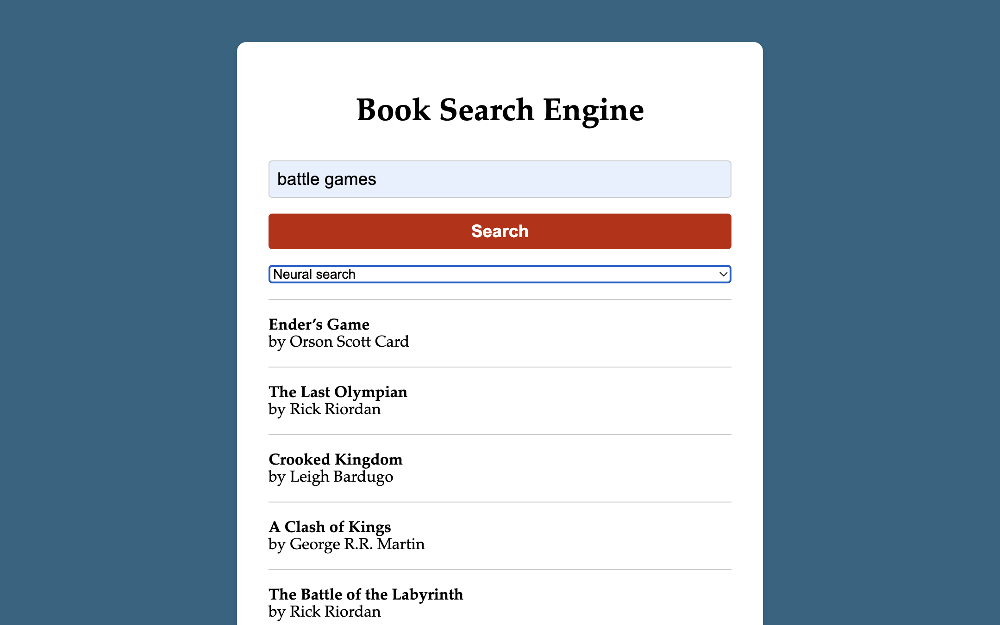

# GoodReads Search Engine

Welcome to the GoodReads Search Engine, a powerful tool for searching and discovering books on GoodReads. 
This repository provides two types of search engines that cater to different search requirements:

1. **Simple Search Engine:** This search engine utilizes Whoosh and BM25 algorithms to provide a straightforward search experience. 
It enables you to search for books based on various criteria and retrieve relevant results efficiently.

2. **Semantic Search Engine:** For more sophisticated searches, we offer an advanced search engine that leverages the SentenceTransformer by HuggingFace 🤗. 
 This engine encodes the title and description of books using cutting-edge techniques and saves the resulting embeddings in an Annoy index. 
 This allows for lightning-fast nearest neighbor search, enabling you to find books similar to your query in terms of content and themes.

Please note that this project is primarily designed for learning purposes, and as such, there may be some known bugs. 
We highly encourage you to contribute by submitting pull requests to help enhance the functionality and reliability of the search engines.

## How to Use

To get started with the GoodReads Search Engine, follow these steps:

1. Clone the repository to your local machine.
2. Create a virtual environment using the command `python -m venv venv`.
3. Install the required dependencies by running `pip install -r requirements.txt`.
4. Setup the dataset by executing `python setup.py --all`. This step involves scraping the GoodReads website for books and saving them in a `jsonl` file. 
 Additionally, it creates the necessary indexes for the search engines.
5. Launch the server by running `python main.py`.

During the setup process, the script will scrape the GoodReads website to retrieve book data. 
Since scraping can occasionally encounter issues with certain books, you can safely rerun the setup script with the `--scrape` flag,
which skips books already present in the dataset. You can achieve higher scraping success also by modifying the parameters in the config file.
Please avoid abusing the GoodReads website during this process.

## Examples
In the example we can see how a query that does not match many books with the simple search engine,
is able to retrieve more relevant results with the semantic search engine.

